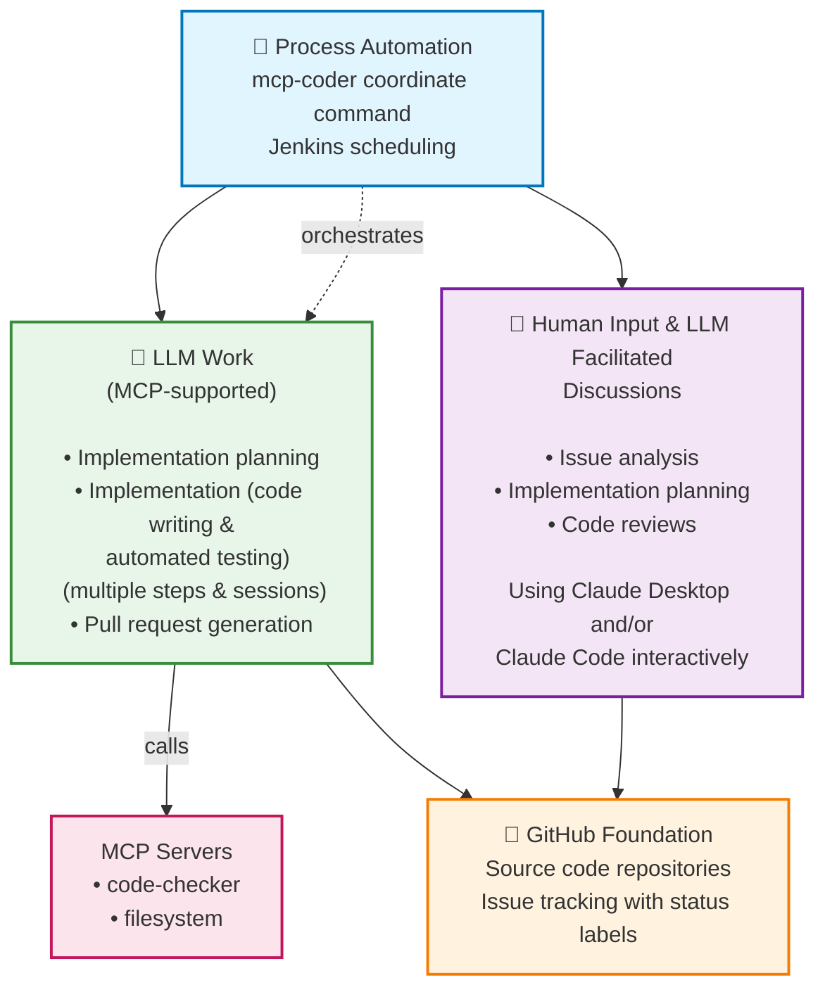

# MCP Coder

**What is MCP Coder?**

An AI-powered software development automation toolkit with human oversight and quality controls. MCP Coder combines intelligent planning discussions with automated implementation, using Claude Code CLI and MCP servers for comprehensive code analysis, testing, and workflow management.

> ⚠️ **Currently in active development** - Core features are being implemented

## 🎯 Vision & Architecture

MCP Coder implements a structured 3-layer development approach that separates human decision-making from AI implementation:

### Three-Layer Architecture

```
┌─────────────────────────────────────────────────────────────────────────┐
│                       🤖 Process Automation                            │
│   mcp-coder coordinate command • Jenkins scheduling                     │
└─────────────────────────────┬───────────────────────────────────────────┘
                              │
                              │        orchestrates
                              │             │
                              ▼             ▼
┌─────────────────────────────────────────┐     ┌─────────────────────────────────────────┐
│  👤 Human Input & LLM Facilitated       │     │          🤖 LLM Work                   │
│           Discussions                   │     │        (MCP-supported)                  │
├─────────────────────────────────────────┤     ├─────────────────────────────────────────┤
│ • Issue analysis                        │     │ • Implementation planning               │
│ • Implementation planning               │     │ • Implementation (code writing &        │
│ • Code reviews                          │     │   automated testing)                    │
│                                         │     │ • Complex project support (multiple     │
│                                         │     │   steps & sessions)                     │
│                                         │     │ • Pull request generation               │
│                                         │     │                                         │
│ Using Claude Desktop and/or             │     │                calls                    │
│ Claude Code interactively               │     │                ▼                       │
│                                         │     │         ┌─────────────────┐             │
│                                         │     │         │  MCP Servers    │             │
│                                         │     │         │ • code-checker  │             │
│                                         │     │         │ • filesystem    │             │
│                                         │     │         └─────────────────┘             │
└─────────────────────────────────────────┘     └─────────────────────────────────────────┘
              │                                       │               
              └───────────────────────────┬───────────────────────────┘
                              ▼
┌─────────────────────────────────────────────────────────────────────────┐
│                     📂 GitHub Foundation                               │
│         Source code repositories • Issue tracking with status labels   │
└─────────────────────────────────────────────────────────────────────────┘
```

### Alternative View: Mermaid Diagram



**Key Separation of Concerns:**

- **🤖 Automated LLM Work**: Automated implementation calling specialized MCP servers for reliable code operations
- **🤖 Process Automation**: `mcp-coder coordinate` command orchestrates LLM work, with Jenkins scheduling for mass execution
- **👤 Human Input & LLM Discussions**: Issue analysis, implementation planning and code review based on LLM-based analysis and interactive discussion using Claude Desktop or Claude Code
- **📂  Foundation: GitHub**: Centralized source code storage and issue management with status labels


## ✨ Current Features

### 🤖 Development Automation
- **Integrated LLMs**: Claude Code CLI and API support (additional LLM providers planned)
- **Automated Implementation**: Complete feature development via `mcp-coder implement`

### 🔄 Interactive Planning & Quality Assurance
- **AI-Driven Feature Planning**: Automated analysis and planning from GitHub issues
- **Test-Driven Development**: Automated TDD with test-first development workflows
- **Comprehensive Quality Gates**: Integration with pylint, pytest, and mypy via MCP servers
- **Human-AI Collaboration**: Structured discussion prompts for requirement refinement

### 🚀 Automated Workflows & GitHub Status Tracking
- **GitHub Integration**: Automated issue labeling, status progression, and PR management
- **Git Operations**: Automated branch creation, staging, committing, pushing, and rebasing
- **Workflow Orchestration**: Automated coordination using `mcp-coordinate`, using issue status tracking and calling Jenkins
- **Mass Execution**: Jenkins integration enables orchestrated automated software development across issues and repositories
- **Separation of Concerns**: Distinct automation layer separate from human discussions
- **Status Tracking**: Developement status progression through GitHub issue labels

## 🚀 Getting Started

### Prerequisites
- **Claude Code CLI**: Install from [Anthropic's documentation](https://docs.anthropic.com/en/docs/claude-code)
- **Python 3.11+**
- **Git** (for repository operations)

### Installation

```bash
git clone https://github.com/MarcusJellinghaus/mcp_coder.git
cd mcp_coder
pip install -e ".[dev]"
```

## 📚 Documentation

### Command Reference
- **[CLI Reference](docs/CLI_REFERENCE.md)** - Complete command documentation and usage examples

### Setup Guides  
- **[Repository Setup](docs/REPOSITORY_SETUP.md)** - GitHub Actions, labels, and repository configuration
- **[Configuration Guide](docs/configuration/CONFIG.md)** - User config files, environment variables, and platform setup

### Development
- **[Development Process](docs/processes_prompts/DEVELOPMENT_PROCESS.md)** - Detailed methodology and workflow documentation

## 🔗 Related Projects

- [mcp-code-checker](https://github.com/MarcusJellinghaus/mcp-code-checker) - Code quality MCP server
- [mcp_server_filesystem](https://github.com/MarcusJellinghaus/mcp_server_filesystem) - File system MCP server

---

*Built with ❤️ and AI by [Marcus Jellinghaus](https://github.com/MarcusJellinghaus)*