# MCP Coder

**What is MCP Coder?**

MCP coder enhances source code with a structured development process that turns GitHub issues into working code automatically. AI supported discussions allow to specify and review the relevant items of the specification, implementation plan and resulting code. Code quality is also ensured by rigorous usage of classical code quality assurance.

**The Complete Development Workflow:**

- **Interactive Planning**: Human-guided requirement analysis and architectural decisions using AI-powered discussions
- **Automated Implementation**: Full feature development with integrated testing, code quality checks, and git operations  
- **Quality Assurance**: Built-in pylint, pytest, and mypy validation ensures production-ready code
- **Intelligent Orchestration**: Process automation across multiple repositories with Jenkins integration

MCP Coder combines the efficiency of AI automation with the reliability of human oversight, creating a development experience that's both faster and more robust than traditional approaches.

## 🎯 Vision & Architecture

MCP Coder implements a structured 3-layer development approach that separates human decision-making from AI implementation:

### Three-Layer Architecture

```
┌─────────────────────────────────────────────────────────────────────────┐
│                       🤖 Process Automation                            │
│   mcp-coder coordinate command • Jenkins scheduling                     │
└─────────────────────────────┬───────────────────────────────────────────┘
                              │
                              │        orchestrates
                              │             │
                              ▼             ▼
┌─────────────────────────────────────────┐     ┌─────────────────────────────────────────┐
│  👤 Human Input & LLM Facilitated       │     │          🤖 LLM Work                   │
│           Discussions                   │     │        (MCP-supported)                  │
├─────────────────────────────────────────┤     ├─────────────────────────────────────────┤
│ • Issue analysis                        │     │ • Implementation planning               │
│ • Implementation planning               │     │ • Implementation (code writing &        │
│ • Code reviews                          │     │   automated testing)                    │
│                                         │     │ • Complex project support (multiple     │
│                                         │     │   steps & sessions)                     │
│                                         │     │ • Pull request generation               │
│                                         │     │                                         │
│ Using Claude Desktop and/or             │     │                calls                    │
│ Claude Code interactively               │     │                ▼                       │
│                                         │     │         ┌─────────────────┐             │
│                                         │     │         │  MCP Servers    │             │
│                                         │     │         │ • code-checker  │             │
│                                         │     │         │ • filesystem    │             │
│                                         │     │         └─────────────────┘             │
└─────────────────────────────────────────┘     └─────────────────────────────────────────┘
              │                                       │               
              └───────────────────────────┬───────────────────────────┘
                              ▼
┌─────────────────────────────────────────────────────────────────────────┐
│                     📂 GitHub Foundation                               │
│         Source code repositories • Issue tracking with status labels   │
└─────────────────────────────────────────────────────────────────────────┘
```

### Alternative View: Mermaid Diagram

```mermaid
flowchart TD
    PA["🤖 Process Automation<br/>mcp-coder coordinate command<br/>Jenkins scheduling"]
    
    HI["👤 Human Input & LLM Facilitated<br/>Discussions<br/><br/>• Issue analysis<br/>• Implementation planning<br/>• Code reviews<br/><br/>Using Claude Desktop and/or<br/>Claude Code interactively"]
    
    LW["🤖 LLM Work<br/>(MCP-supported)<br/><br/>• Implementation planning<br/>• Implementation (code writing &<br/>  automated testing)<br/> (multiple steps & sessions)<br/>• Pull request generation"]
    
    MCP["MCP Servers<br/>• code-checker<br/>• filesystem"]
    
    GH["📂 GitHub Foundation<br/>Source code repositories<br/>Issue tracking with status labels"]
    
    PA -.->|orchestrates| LW
    PA --> HI
    PA --> LW
    LW -->|calls| MCP
    HI --> GH
    LW --> GH
    
    classDef automation fill:#e1f5fe,stroke:#0277bd,stroke-width:2px
    classDef human fill:#f3e5f5,stroke:#7b1fa2,stroke-width:2px
    classDef llm fill:#e8f5e9,stroke:#388e3c,stroke-width:2px
    classDef foundation fill:#fff3e0,stroke:#f57c00,stroke-width:2px
    classDef mcp fill:#fce4ec,stroke:#c2185b,stroke-width:2px
    
    class PA automation
    class HI human
    class LW llm
    class GH foundation
    class MCP mcp
```



**Key Separation of Concerns:**

- **🤖 Automated LLM Work**: Automated implementation calling specialized MCP servers for reliable code operations
- **🤖 Process Automation**: `mcp-coder coordinate` command orchestrates LLM work, with Jenkins scheduling for mass execution
- **👤 Human Input & LLM Discussions**: Issue analysis, implementation planning and code review based on LLM-based analysis and interactive discussion using Claude Desktop or Claude Code
- **📂  Foundation: GitHub**: Centralized source code storage and issue management with status labels

## ✨ Current Features

### 🤖 Development Automation

- **Integrated LLMs**: Claude Code CLI support (additional LLM providers planned)
- **Automated Implementation**: Complete feature development via `mcp-coder implement`

### 🔄 Interactive Planning & Quality Assurance

- **AI-Driven Feature Planning**: Automated analysis and planning from GitHub issues
- **Test-Driven Development**: Automated TDD with test-first development workflows
- **Comprehensive Quality Gates**: Integration with pylint, pytest, and mypy via MCP servers
- **Human-AI Collaboration**: Structured discussion prompts for requirement refinement

### 🚀 Automated Workflows & GitHub Status Tracking

- **GitHub Integration**: Automated issue labeling, status progression, and PR management
- **Git Operations**: Automated branch creation, staging, committing, pushing, and rebasing
- **Compact diff** (`mcp-coder git-tool compact-diff`): reduces large refactoring diffs for LLM review by replacing moved code blocks with summary comments
- **Workflow Orchestration**: Automated coordination using `mcp-coder coordinate`, using issue status tracking and calling Jenkins
- **Mass Execution**: Jenkins integration enables orchestrated automated software development across issues and repositories
- **Separation of Concerns**: Distinct automation layer separate from human discussions
- **Status Tracking**: Development status progression through GitHub issue labels

## 🚀 Getting Started

### Prerequisites

- **Claude Code CLI**: Install from [Anthropic's documentation](https://docs.anthropic.com/en/docs/claude-code)
- **Python 3.11+**
- **Git** (for repository operations)
- **Code base hosted on GitHub**

### Installation

```bash
git clone https://github.com/MarcusJellinghaus/mcp_coder.git
cd mcp_coder
pip install -e ".[dev]"
```

## 📚 Documentation

**[Full Documentation Index](docs/README.md)** - Complete list of all documentation

### Quick Links

- **[CLI Reference](docs/cli-reference.md)** - Complete command documentation and usage examples
- **[Repository Setup](docs/repository-setup.md)** - GitHub Actions, labels, and repository configuration
- **[Configuration Guide](docs/configuration/config.md)** - User config files, environment variables, and platform setup
- **[Development Process](docs/processes-prompts/development-process.md)** - Detailed methodology and workflow documentation

## 🔗 Related Projects

- [mcp-code-checker](https://github.com/MarcusJellinghaus/mcp-code-checker) - Code quality MCP server
- [mcp_server_filesystem](https://github.com/MarcusJellinghaus/mcp_server_filesystem) - File system MCP server

---

*Built with ❤️ and AI by [Marcus Jellinghaus](https://github.com/MarcusJellinghaus)*
