# Development Process

## 🎯 High-Level Overview

Structured LLM-assisted development workflow orchestrated by a human developer. The process breaks down features into manageable steps with automated quality checks and git operations.

```mermaid
flowchart LR
    Issue[📥 GitHub Issue] --> P0[👤 Issue Discussion]
    P0 --> P1[🤖 Feature Planning]
    P1 --> Plan[📋 Plan in pr_info/]
    Plan --> P2[🤖 Implementation]
    P2 --> Code[💻 Code on Branch]
    Code --> P3[🤖 Create PR]
    P3 --> PR[✅ Pull Request]
    
    Plan -.-> P1
    Code -.-> P2
    PR -.-> P2
    
    classDef io fill:#e3f2fd,stroke:#1976d2,stroke-width:2px
    classDef human fill:#fff9e6,stroke:#ff9800,stroke-width:2px
    classDef bot fill:#f3e5f5,stroke:#7b1fa2,stroke-width:2px
    
    class Issue,Plan,Code,PR io
    class P0 human
    class P1,P2,P3 bot
```



### Key Characteristics

**🎭 Roles:**
- **Human Orchestrator** - Guides process, makes decisions, reviews outputs
- **LLM Assistant** - Generates code, plans, documentation via structured prompts
- **Automated Tools** - Quality checks (pylint, mypy, pytest), formatting, git operations

**📊 Workflow Phases:**
- **Phase 0 (Optional):** Requirements discussion without code
- **Phase 1:** Strategic planning and step breakdown  
- **Phase 2:** Iterative implementation with validation (main development loop)
- **Phase 3:** Quality review, documentation, and PR creation

**✨ Quality Gates:**
- All code changes validated through: **pylint** → **pytest** → **mypy**
- Automated formatting with **black** and **isort**
- Git commits only after all checks pass
- Full PR review before completion

**🔄 Iteration Support:**
- Can loop back to earlier phases when issues discovered
- Flexible context management for long conversations
- Step-by-step approach prevents overwhelming changes

---

## Detailed Workflow Diagrams

Each workflow shows the transition between status labels, the artifacts produced, and the tools used.

### 1. Issue Discussion Workflow

```mermaid
flowchart LR
    Input[📥 GitHub Issue<br/>status:created]
    Process[👤 Issue Discussion<br/>Human + LLM]
    Output1[📄 Refined Issue]
    Output2[🏷️ status:awaiting-planning]
    
    Input --> Process
    Process --> Output1
    Process --> Output2
    
    classDef status fill:#e8f5e9,stroke:#4caf50,stroke-width:2px
    classDef artifact fill:#e3f2fd,stroke:#1976d2,stroke-width:2px
    classDef process fill:#fff9e6,stroke:#ff9800,stroke-width:2px
    
    class Input,Output2 status
    class Output1 artifact
    class Process process
```



**Tools:** Claude Desktop/Chat  
**Key Steps:**
- Discuss requirements and feasibility
- Refine issue description
- Add implementation hints (without detailed plan)

**Prompts:**

<details>
<summary>📋 Issue Discussion - Initial (click to expand and copy)</summary>

```
Can we discuss a requirement / implementation idea and its feasability?
Do not provide code yet!
At the end of our discussion, I want to have an even better issue description
```
</details>

<details>
<summary>📋 Issue Discussion - Draft Issue Text (click to expand and copy)</summary>

```
Let's draft the issue text, with some very limited, concise implementation ideas.
The implementation plan should be developed later. Focus on the issue.
Please provide the issue text (with issue header!) as markdown artifact, so that I can easily update the issue on GitHub.
```
</details>

---

### 2. Plan Creation Workflow

```mermaid
flowchart LR
    Input[🏷️ status:awaiting-planning]
    Process[🤖 Create Plan<br/>Bot]
    Working[🏷️ status:planning]
    Output1[📋 Implementation Plan<br/>in pr_info/]
    Output2[🏷️ status:plan-review]
    
    Input --> Process
    Process --> Working
    Working --> Output1
    Working --> Output2
    
    classDef status fill:#e8f5e9,stroke:#4caf50,stroke-width:2px
    classDef artifact fill:#e3f2fd,stroke:#1976d2,stroke-width:2px
    classDef process fill:#f3e5f5,stroke:#7b1fa2,stroke-width:2px
    
    class Input,Working,Output2 status
    class Output1 artifact
    class Process process
```



**Tool:** `workflows\create_plan`  
**Key Steps:**
- Create feature branch
- Analyze requirements
- Generate implementation steps
- Create summary.md, step_*.md, TASK_TRACKER.md

**Prompts:**
- 🔗 [Initial Analysis](../src/mcp_coder/prompts/prompts.md#initial-analysis)
- 🔗 [Simplification Review](../src/mcp_coder/prompts/prompts.md#simplification-review)
- 🔗 [Implementation Plan Creation](../src/mcp_coder/prompts/prompts.md#implementation-plan-creation)

---

### 3. Plan Review Workflow

```mermaid
flowchart LR
    Input1[🏷️ status:plan-review]
    Input2[📋 Plan in pr_info/]
    Process[👤 Review Plan<br/>Human + Bot]
    Decision{Approved?}
    Revise[🔄 Revise Plan]
    Output[🏷️ status:plan-ready]
    
    Input1 --> Process
    Input2 --> Process
    Process --> Decision
    Decision -->|Yes| Output
    Decision -->|No| Revise
    Revise --> Process
    
    classDef status fill:#e8f5e9,stroke:#4caf50,stroke-width:2px
    classDef artifact fill:#e3f2fd,stroke:#1976d2,stroke-width:2px
    classDef process fill:#fff9e6,stroke:#ff9800,stroke-width:2px
    classDef decision fill:#fff3e0,stroke:#f57c00,stroke-width:2px
    
    class Input1,Output status
    class Input2 artifact
    class Process process
    class Decision,Revise decision
```



**Tools:** Claude Desktop, interactive prompts  
**Key Steps:**
- Review step breakdown and complexity
- Discuss and refine approach
- Update plan files with decisions
- Log decisions in Decisions.md

**Prompts:**
- 🔗 [Plan Review prompts](#plan-review) (detailed section below)

#### Detailed Plan Review Process

**Objective:** Break down feature into manageable implementation steps

**Process:**
1. **Create separate branch** for the feature development
2. **Initial analysis** - Understand existing solution and requirements
3. **Create implementation plan** - Generate summary and step-by-step breakdown
4. **Review and refine** - Discuss and optimize the plan
5. **Finalize plan** - Update all planning documents

**Implementation Flow:**
- Use **Implementation Task Coordinator** to manage n implementation prompts
- Execute all implementation steps through coordinated prompts
- Each step references summary and specific step details

**Outputs:**
- New feature branch
- Updated `TASK_TRACKER.md` with new tasks
- Individual step detail files (`steps/step_N.md`)
- Background documentation (`summary.md`)
- ( Future: Updated `Task_Tracker.md` )

**Tools & Prompts:**

##### First plan

To work on an open issue, a branch should be generated and switched.
The branch should be checked out.
The requirements and dev requirements should be installed.
The MCP server should be configured.
The Claude Code system prompt should be configured.

Based on three prompts, an initial plan can be generated.

See: [Plan Generation Workflow](../src/mcp_coder/prompts/prompts.md#plan-generation-workflow) in `src/mcp_coder/prompts/prompts.md`

**Commit** the initial plan with 
```
Initial plan generated for issue #<number>
``` 

##### Plan Review

The plan should be interactively reviewed, eg using Claude Desktop.
Claude Desktop should be configured for that.

```
Please review the project plan for a new feature in folder PR_Info\steps.
Please revise the project plan with a balanced level of detail.
Please let me know if any complexity could be reduced.
Please let me know any questions / comments or suggestions you might have.

Please consider the already discussed and decided decisions (if any) under decisions.
We do not need to challenge them again unless absolutely necessary.
```

**Issue Pyproject.toml requirements updates**:
```
In case of after updating the pyproject.toml requirements, 
put something in the project plan to stop and tell me, 
so that I can install the requiremetns. 
This is important so that unit tests can work.
```

Wait for presentation of overall plan
```
Can we go through all open suggested changes and questions step by step?
You explain, ask and I answer until we discussed all topics?
Please offer, whenever possible, simple options like 
- A
- B
- C
Always just ask ONE question
```

If there are inconsistencies in the project plan (eg due to previous revisions with incomplete adjustments):
```
Please clean up the project plan. Ensure that it is consistent.
```
```
Please review the project plan for a new feature in the folder PR_Info\steps.
Please review for consistency.
Please tell me all inconsistencies you find and how you want to fix them.
```

**typical questions and answers**:
- reduce number of steps: actually, constant/more steps are better
- number of test cases:
  - possible options eg 
    - comprehensive
    - with several edge cases
    - essentials
- possible answer
  - essentials
- data model
  - do we need all fields
  - do we need the data model at all?
  - stay type safe / explicit (often yet)
- performance
  - the question is even asked when processing small amounts of data
- generic extensions like config files, logging, e  


**Possible issues to double-check**:
- Are the tests following the folder structure similar to the implemented features?
- Do you implement something related to backwards compatibility?


Wait for end of discussion - in case of unclarity
```
Please summarise the changes you want to do to the project plan for confirmation as 
( one liner bullet points)
```

After the agreement:
```
Can you update the plan by updating the different files in folder `pr_info\steps`
Please do targeted changes.

Please log the decisions from our discussion in `PR_Info\steps\Decisions.md`.
Only put those decisions that we discussed, no invented decisions 
( For each decision that you log, consider whether you discussed it with me and when I said so )

```

Commit with
```
Updated project plan
```

Possibly review the project plan one more time (see above) or continue with the next step.

---

### 4. Implementation Workflow

```mermaid
flowchart LR
    Input[🏷️ status:plan-ready]
    Process[🤖 Implementation<br/>Bot]
    Working[🏷️ status:implementing]
    Output1[💻 Code on Branch]
    Output2[🏷️ status:code-review]
    
    Input --> Process
    Process --> Working
    Working --> Output1
    Working --> Output2
    
    classDef status fill:#e8f5e9,stroke:#4caf50,stroke-width:2px
    classDef artifact fill:#e3f2fd,stroke:#1976d2,stroke-width:2px
    classDef process fill:#f3e5f5,stroke:#7b1fa2,stroke-width:2px
    
    class Input,Working,Output2 status
    class Output1 artifact
    class Process process
```



**Tool:** CLI command `implement`  
**Key Steps:**
- Implement each step from TASK_TRACKER.md
- Run quality checks (pylint → pytest → mypy)
- Format code (black, isort, ruff)
- Commit changes

**Prompts:**
- 🔗 [Task Tracker Update Prompt](../src/mcp_coder/prompts/prompts.md#task-tracker-update-prompt)
- 🔗 [Implementation Prompt Template](../src/mcp_coder/prompts/prompts.md#implementation-prompt-template-using-task-tracker)
- 🔗 [Mypy Fix Prompt](../src/mcp_coder/prompts/prompts.md#mypy-fix-prompt)

#### Detailed Implementation Process

**Preparing for implementation:**

##### Task Tracker Update Prompt:

See: [Task Tracker Update Prompt](../src/mcp_coder/prompts/prompts.md#task-tracker-update-prompt) in `src/mcp_coder/prompts/prompts.md`

- commit afterwards with 
  ```
  TASK_TRACKER.md with implementation steps and PR tasks updated
  ```

**Objective:** Complete each implementation step with full validation

Each step consists of two main phases:

##### 2.1 Code Implementation and Quality Validation

**Process:**
- Implement the required functionality
- Follow TDD practices where applicable
- Run comprehensive quality checks
- Fix all issues until checks pass

**Quality Validation Steps:**
- **Run pytest:**
  - Execute all tests
  - Check for side effects (test files, temporary data)
  - Ensure cleanup - no remaining artifacts after test completion
  - Fix any test failures
- **Run pylint:**
  - Check code quality and style
  - Resolve any issues found
- **Run mypy:**
  - Perform type checking
  - Fix type-related issues

**Context Length Considerations:**
- **Preferred:** Complete all implementation and validation in one conversation
- **If context limit reached:** Acceptable to run mypy checks and fixes separately
- **Less preferred but possible:** Run pytest and pylint separately if needed

**Tools:**
- `tools/checks2clipboard.bat` - **Primary tool**: Run all checks (pylint, pytest, mypy) and copy results to clipboard for LLM analysis
  - Handles test side effects checking
  - Provides structured output for LLM review
  - Sequential execution: pylint → pytest → mypy
  - Only proceeds if previous checks pass

**Implementation Prompt Template using task tracker**

See: [Implementation Prompt Template using task tracker](../src/mcp_coder/prompts/prompts.md#implementation-prompt-template-using-task-tracker) in `src/mcp_coder/prompts/prompts.md`

Possible follow up question:
```
Did you implement everything of the current step?
Do you have a commit message?
Did you tick of the tasks in the task tracker?
```

**Common Implementation Failures & Responses:**

- ** Checks do not work **
  - Sometimes, mypy tests were forgotten and do not work:
    - Prompt 
      ```
      Please run mypy checks and work on possible issues and fix it.
      ```
    - run pylint and pytest after that
    - run formatter after that
    - commit with auto and/or with mypy fixing info, or ask session for a commit message
      ```
      Please provide a concise commit message  in markdown code format (```)
      ``` 
      - triple ticks might or might not be provided
      - Claude might add a useless footer:
        ``` 
         🤖 Generated with [Claude Code](https://claude.ai/code)

          Co-Authored-By: Claude <noreply@anthropic.com>
        ```

- **Third-party dependencies needed:**
  - New Python packages required beyond current `pyproject.toml`
  - Dependencies not available in project's virtual environment
  - *Response:* Update `pyproject.toml` dependencies, run `pip install -e .[dev]` to reinstall project with new requirements

- **Implementation doesn't work:**
  - *Analyze root cause:* Ask for real issue details
  - *Too big:* Break down into several smaller tasks
  - *Too complex:* Simplify approach, create multiple files
  - *Incorrect task description:* May need implementation with next task
  - *Third-party library issues:* Library doesn't work as expected, causes confusion
  - *Response:* Fix issue, improve task description, update plan
  - *Initial technology evaluation missing* Add a step 0 to evaluate a technology. Execute that, update plan

- **Implementation works but requires no changes:**
  - Task was unnecessary or already implemented
  - *Response:* Mark as complete, update plan for remaining tasks
  
- ** Check for slower and slower unit tests **

- ** Check for file / folder / module names **
  - Files or folders might have wrong location or names. Eg test files should follow the same folder structure like the code.


** Possible prompt for too complex task**

```
Please look at pr_info/TASK_TRACKER.md and pick the next task that should be done.
Please let me know on which task you are working on.

Actually, please do not work on the task right now.

Rather review the task (and the summary and the related code base etc)
And tell me what needs to be done
Please tell me whether this is feasible, how complicated it is, whether it could be simplified or whether it needs to broken down in several sub tasks.
```

##### One shot tasks

( still to be done)


##### Working with Todos

Put some todos in your code and work on them using 

```commandline
Please take a look
[this file]

There are many todos in there - please take the first one, can we work on just the first one
Tell me what needs to be done, do not yet modify any code!
```


##### 2.4 Commit Preparation

**Process:**
- format
- get commit message
  - Parse commit message from chat conversation
  - If no commit message found, auto create one
- commit changes

**Commit Message Prompt when working on a step:**
```
Please provide a short concise commit message stating the step name in the title.
```


**Commit message prompt after a small change:**
```
Can you provide a short commit message with short info on relevant changes?
```
This could benefit from `format_and_commit` tool.

**Tools:**
- `tools/format_all.bat` - Run all formatting tools (ruff, black, isort)
- `mcp-coder commit clipboard` - to commit all changes with a commit message from the clipboard
- `mcp-coder commit auto` - to commit all changes with a commit message generated via LLM from the git diff

---

### 5. Code Review Workflow

```mermaid
flowchart LR
    Input1[🏷️ status:code-review]
    Input2[💻 Code on Branch]
    Process[👤 Review Code<br/>Human + Bot]
    Decision{Approved?}
    Fix[🔧 Fix Issues]
    Output[🏷️ status:ready-pr]
    
    Input1 --> Process
    Input2 --> Process
    Process --> Decision
    Decision -->|Yes| Output
    Decision -->|No| Fix
    Fix --> Process
    
    classDef status fill:#e8f5e9,stroke:#4caf50,stroke-width:2px
    classDef artifact fill:#e3f2fd,stroke:#1976d2,stroke-width:2px
    classDef process fill:#fff9e6,stroke:#ff9800,stroke-width:2px
    classDef decision fill:#fff3e0,stroke:#f57c00,stroke-width:2px
    
    class Input1,Output status
    class Input2 artifact
    class Process process
    class Decision,Fix decision
```



**Tools:** `pr_review.bat`, checks2clipboard.bat  
**Key Steps:**
- Review implementation completeness
- Check code quality and tests
- Run additional validation
- Address feedback and fix issues

**Prompts:**
- 🔗 [Code Review prompts](#32-pr-review) (detailed section below)

#### Detailed Code Review Process

**Objective:** Review and document the completed feature

After all implementation steps are complete:

##### 3.1 Run more detailed checks

Run certain checks in an automated way and deal with possibly highlighted issues:
- Pylint warnings
- (custom checks - to be developed)
- Check pytest runtime


##### 3.2 PR Review

**Process:**
- Review the entire pull request for the feature via an LLM prompt
  - `tools/pr_review.bat` - Generate detailed PR review prompt with git diff
- Review of of LLM review output, possible further implementation steps (see above).

**Tools:**


**Discussion prompt**
```
Can we go through all open suggested changes and questions step by step?
You explain, ask and I answer until we discussed all topics?
Please offer, whenever possible, simple options like 
- A
- B
- C

We will use the discussion later to add more tasks to the implementation plan files under pr_info\steps
```

**Create further implementation tasks**
```
## Request to append new implementation tasks to Python Project Implementation Plan
Please expand the the **implementation plan** stored under `pr_info/steps`
Update the `PR_Info\steps\Decisions.md` with the decisions we took.
Please create additional self-contained steps (`pr_info/steps/step_1.md`, `pr_info/steps/step_2.md`, etc.).
Please update the **summary** (`pr_info/steps/summary.md`).  

### Requirements for the new implementation steps:
- Follow **Test-Driven Development** where applicable. 
  Each step should have its own test implementation followed by related functionality implementation.  
- Each step must include a **clear LLM prompt** that references the summary and that specific step
- Apply **KISS principle** - minimize complexity, maximize maintainability
- Keep code changes minimal and follow best practices

### Each Step Must Specify:
- **WHERE**: File paths and module structure
- **WHAT**: Main functions with signatures
- **HOW**: Integration points (decorators, imports, etc.)
- **ALGORITHM**: 5-6 line pseudocode for core logic (if any)
- **DATA**: Return values and data structures
```

---

### 6. PR Creation Workflow

```mermaid
flowchart LR
    Input[🏷️ status:ready-pr]
    Process[🤖 Create PR<br/>Bot]
    Working[🏷️ status:pr-creating]
    Output1[✅ Pull Request]
    Output2[📄 PR Summary]
    Output3[🏷️ status:pr-created]
    
    Input --> Process
    Process --> Working
    Working --> Output1
    Working --> Output2
    Working --> Output3
    
    classDef status fill:#e8f5e9,stroke:#4caf50,stroke-width:2px
    classDef artifact fill:#e3f2fd,stroke:#1976d2,stroke-width:2px
    classDef process fill:#f3e5f5,stroke:#7b1fa2,stroke-width:2px
    
    class Input,Working,Output3 status
    class Output1,Output2 artifact
    class Process process
```



**Tool:** `workflows\create_pr`  
**Key Steps:**
- Generate PR summary from git diff
- Clean up pr_info folder
- Push branch to remote
- Create pull request on GitHub

**Prompts:**
- 🔗 [PR Summary Generation](../src/mcp_coder/prompts/prompts.md#pr-summary-generation)
- 🔗 [PR Creation details](#33-create-summary) (detailed section below)

#### Detailed PR Creation Process

##### 3.3 Create Summary

**Process:**
- Generate comprehensive feature summary
- Document what was implemented and why
- Create PR description for external review
- Clean up PR_Info folder

**Tools:**
- `tools/pr_summary.bat` - Generate PR summary creation prompt
  - Reads PR_Info folder context
  - Includes full git diff for comprehensive summary
  - Saves result as `PR_Info/summary.md`
  - Provides structured prompt for LLM summary generation
  - Cleans up development artifacts: deletes `steps/` subfolder and clears Tasks section from `TASK_TRACKER.md`
  - commit everything except `PR_Info/summary.md` with commit message
    ```
    pr_info\steps cleaned up
    ```

- could be automated
  - get base_branch (or assume main)
  - read PR_Info\pr_summary.md text into temp variable and delete file later.
  - delete PR_Info\pr_summary.md file
  - commit file cleanup
  - push
  - create PR
  - split pr_summary in header and text

**Final Clean State:**
After feature completion, the cleaned `TASK_TRACKER.md` should contain only the template structure:
```markdown
# Task Status Tracker

## Instructions for LLM

This tracks **Feature Implementation** consisting of multiple **Implementation Steps** (tasks).

**Development Process:** See [DEVELOPMENT_PROCESS.md](./DEVELOPMENT_PROCESS.md) for detailed workflow, prompts, and tools.

**How to update tasks:**
1. Change [ ] to [x] when implementation step is fully complete (code + checks pass)
2. Change [x] to [ ] if task needs to be reopened
3. Add brief notes in the linked detail files if needed
4. Keep it simple - just GitHub-style checkboxes

**Task format:**
- [x] = Implementation step complete (code + all checks pass)
- [ ] = Implementation step not complete
- Each task links to a detail file in PR_Info/ folder

---

## Tasks

```

---

### 7. PR Review & Merge Workflow

```mermaid
flowchart LR
    Input1[🏷️ status:pr-created]
    Input2[✅ Pull Request]
    Process[👤 Review PR<br/>Human]
    Decision{Approved?}
    Rework[🔄 Major Rework]
    Output[🎉 Merged & Closed]
    
    Input1 --> Process
    Input2 --> Process
    Process --> Decision
    Decision -->|Yes| Output
    Decision -->|No| Rework
    Rework -.-> |Back to Implementation| Input1
    
    classDef status fill:#e8f5e9,stroke:#4caf50,stroke-width:2px
    classDef artifact fill:#e3f2fd,stroke:#1976d2,stroke-width:2px
    classDef process fill:#fff9e6,stroke:#ff9800,stroke-width:2px
    classDef decision fill:#fff3e0,stroke:#f57c00,stroke-width:2px
    classDef done fill:#c8e6c9,stroke:#388e3c,stroke-width:3px
    
    class Input1 status
    class Input2 artifact
    class Process process
    class Decision,Rework decision
    class Output done
```



**Tools:** GitHub PR interface  
**Key Steps:**
- Final review of changes
- Check CI/CD passes
- Approve and merge PR
- Close related issue

**Prompts:**
- This is a manual review process using GitHub's web interface
- No specific prompts needed - human judgment and approval

