# Development Process

> **📝 Note:** Cross-file anchor links (e.g., `[text](file.md#section)`) work in PyCharm 2024.3.5+ but not in PyCharm 2025.2.x.

## 🎯 High-Level Overview

Structured LLM-assisted development workflow orchestrated by a human developer. The process breaks down features into manageable steps with automated quality checks and git operations.


**Note:** *Workflow supports iteration - plans can be revised during review, code can be reworked during review, and PRs may require returning to implementation for major changes.*

**Detailed Workflows:** See sections below for step-by-step details: 
- [1. Issue Discussion](#1-issue-discussion-workflow) 
- [2. Plan Creation](#2-plan-creation-workflow) 
- [3. Plan Review](#3-plan-review-workflow)
- [4. Implementation](#4-implementation-workflow)
- [5. Code Review](#5-code-review-workflow)
- [6. PR Creation](#6-pr-creation-workflow)
- [7. PR Review & Merge](#7-pr-review--merge-workflow)

### Key Characteristics

**🎭 Roles:**
- **Human Orchestrator** - Guides process, makes decisions, reviews outputs
- **LLM Assistant** - Generates code, plans, documentation via structured prompts
- **Automated Tools** - Quality checks (pylint, mypy, pytest), formatting, git operations

---

## Detailed Workflows

**Purpose:** Ensure clear objectives, technical feasibility, and resolve unknowns (new libraries, APIs) before implementation.

Each workflow shows status transitions, artifacts, and tools used.

### 1. Issue Discussion Workflow

**📍 Position in Flow:** `status:created` → **👤 Issue Discussion** → `status:awaiting-planning`

```mermaid
flowchart LR
    Input[📥 GitHub Issue<br/>status:created]
    Process[👤 Issue Discussion<br/>Human + LLM]
    Output1[📄 Refined GitHub Issue]
    Output2[🏷️ status:awaiting-planning]
    
    Input --> Process
    Process --> Output1
    Process --> Output2
    
    classDef statusCreated fill:#10b981,stroke:#059669,stroke-width:3px,color:#ffffff
    classDef statusAwaitingPlanning fill:#6ee7b7,stroke:#34d399,stroke-width:2px,color:#065f46
    classDef artifact fill:#e3f2fd,stroke:#1976d2,stroke-width:2px
    classDef process fill:#fff9e6,stroke:#ff9800,stroke-width:2px
    
    class Input statusCreated
    class Output2 statusAwaitingPlanning
    class Output1 artifact
    class Process process
```



**Tools:** Claude Desktop/Chat  
**Key Steps:**
- Discuss requirements and feasibility
- Refine issue description
- Add implementation hints (without detailed plan)
- **Approve:** Add `/approve` as a comment on the GitHub issue to transition to `status:awaiting-planning`

**Prompts:**

<details>
<summary>📋 Issue Discussion - Initial (click to expand and copy)</summary>

```
Can we discuss a requirement / implementation idea and its feasibility?
Please also look at the code base to understand the context (using the different tools with access to the project directory ).
Do not provide code yet!
At the end of our discussion, I want to have an even better issue description.
```
</details>

<details>
<summary>📋 Issue Discussion - Draft Issue Text (click to expand and copy)</summary>

```
Let's draft the issue text, with some very limited, concise implementation ideas.
The implementation plan should be developed later. Focus on the issue and include the discussed details.
Please provide the issue text (with issue header!) as markdown artifact, so that I can easily update the issue on GitHub.
```
</details>

---

### 2. Plan Creation Workflow

**📍 Position in Flow:** `status:awaiting-planning` → **🤖 create_plan** (`status:planning`) → `status:plan-review`

```mermaid
flowchart LR
    Input[🏷️ status:awaiting-planning]
    Process[🤖 Create Plan<br/>Bot]
    Working[🏷️ status:planning]
    Output1[📋 Implementation Plan<br/>in pr_info/]
    Output2[🏷️ status:plan-review]
    
    Input --> Process
    Process --> Working
    Working --> Output1
    Working --> Output2
    
    classDef status fill:#e8f5e9,stroke:#4caf50,stroke-width:2px
    classDef artifact fill:#e3f2fd,stroke:#1976d2,stroke-width:2px
    classDef process fill:#f3e5f5,stroke:#7b1fa2,stroke-width:2px
    
    class Input,Working,Output2 status
    class Output1 artifact
    class Process process
```



#### Tool: `workflows\create_plan` (fully automated)

**Output:** Implementation plan files with summary and steps (summary.md, step_*.md)

**Process:**
- Creates feature branch
- Analyzes requirements
- Generates plan using three prompts (🔗 [prompts.md](../src/mcp_coder/prompts/prompts.md#plan-generation-workflow)):
  - 🔗 [Initial Analysis](../src/mcp_coder/prompts/prompts.md#initial-analysis)
  - 🔗 [Simplification Review](../src/mcp_coder/prompts/prompts.md#simplification-review)
  - 🔗 [Implementation Plan Creation](../src/mcp_coder/prompts/prompts.md#implementation-plan-creation)

---

### 3. Plan Review Workflow

**📍 Position in Flow:** `status:plan-review` → **👤 Plan Review** → `status:plan-ready`


**Interactive Review Process:**
1. **Review the project plan**
   <details>
   <summary>📋 Review the implementation plan</summary>
   
   ```
   Please review the project plan for a new feature in folder PR_Info\steps.
   Please revise the project plan with a balanced level of detail.
   Please let me know if any complexity could be reduced.
   Please let me know any questions / comments or suggestions you might have.
   
   Please consider the already discussed and decided decisions (if any) under decisions.
   We do not need to challenge them again unless absolutely necessary.
   ```
   </details>

2. **Step-by-step discussion**
   <details>
   <summary>📋 For simplicity, go for a simple step-by-step discussion</summary>
   
   ```
   Can we go through all open suggested changes and questions step by step?
   You explain, ask and I answer until we discussed all topics?
   Please offer, whenever possible, simple options like 
   - A
   - B
   - C
   Always just ask ONE question
   ```
   </details>

3. **Update plan files**
   <details>
   <summary>📋 Update Plan Files</summary>
   
   ```
   Can you update the plan by updating the different files in folder `pr_info\steps`
   Please do targeted changes.
   
   Please log the decisions from our discussion in `PR_Info\steps\Decisions.md`.
   Only put those decisions that we discussed, no invented decisions 
   ( For each decision that you log, consider whether you discussed it with me and when I said so )
   ```
   </details>

4. **Iterate until complete** - Review the plan with the LLM several times, until no more changes are required.

5. **Approve:** Add `/approve` as a comment on the GitHub issue to transition to `status:plan-ready`

**Additional Prompts (for special cases):**


<details>
<summary>📋 Requirements Update Note</summary>

```
In case of after updating the pyproject.toml requirements, 
put something in the project plan to stop and tell me, 
so that I can install the requirements. 
This is important so that unit tests can work.
```
Alternatively, update the pyproject.toml already at this stage, and install the dependencies (if required).
</details>


<details>
<summary>📋 Consistency Review</summary>

```
Please clean up the project plan. Ensure that it is consistent.
```

or

```
Please review the project plan for a new feature in the folder PR_Info\steps.
Please review for consistency.
Please tell me all inconsistencies you find and how you want to fix them.
```
</details>

<details>
<summary>📋 Change Summary Request</summary>

```
Please summarise the changes you want to do to the project plan for confirmation as 
(one-liner bullet points)
```
Use in case of uncertainty.
</details>


**🔄 Alternative Paths:**
- **Minor Revisions:** Loop back within the review process - refine and re-discuss plan details, e.g., until no more changes required.
- **Major Restart:** Return to `status:awaiting-planning` if fundamental approach needs reconsideration. In this case, delete the files for the implementation plan.

---

### 4. Implementation Workflow

**📍 Position in Flow:** `status:plan-ready` → **🤖 implement** (`status:implementing`) → `status:code-review`

```mermaid
flowchart LR
    Input[🏷️ status:plan-ready]
    Process[🤖 Implementation<br/>Bot]
    Working[🏷️ status:implementing]
    Output1[💻 Code on Branch]
    Output2[🏷️ status:code-review]
    
    Input --> Process
    Process --> Working
    Working --> Output1
    Working --> Output2
    
    classDef status fill:#e8f5e9,stroke:#4caf50,stroke-width:2px
    classDef artifact fill:#e3f2fd,stroke:#1976d2,stroke-width:2px
    classDef process fill:#f3e5f5,stroke:#7b1fa2,stroke-width:2px
    
    class Input,Working,Output2 status
    class Output1 artifact
    class Process process
```



#### Tool: `mcp-coder implement` (fully automated)

**✨ Quality Gates:**
- All code changes validated through: **pylint** → **pytest** → **mypy**, by llm and by routine when implementation is done
- Automated formatting with **black** and **isort**
- Git commits only after all checks pass

**🔄 Iteration Support:**
- Project plan contains several steps, implementation loops over the steps
- Each step starts with a fresh context
- Step-by-step approach prevents overwhelming changes

**Output:** Implemented code with all quality checks passed

**Process:**
- Updates TASK_TRACKER.md with implementation steps
- Implements each step from the tracker
- Runs quality checks (pylint → pytest → mypy) after each step
- Formats code (black, isort, ruff)
- Commits changes with descriptive messages
- Uses prompts (🔗 [prompts.md](../src/mcp_coder/prompts/prompts.md)):
  - 🔗 [Implementation Prompt Template](../src/mcp_coder/prompts/prompts.md#implementation-prompt-template-using-task-tracker)
  - 🔗 [Task Tracker Update](../src/mcp_coder/prompts/prompts.md#task-tracker-update-prompt)
  - 🔗 [Mypy Fix](../src/mcp_coder/prompts/prompts.md#mypy-fix-prompt)

**🔄 Alternative Paths:**
- (WIP)
- **Plan Issues Discovered:** Return to `status:plan-review` if implementation reveals plan needs adjustment
- **Critical Blocker:** Return to `status:awaiting-planning` if fundamental redesign required

#### Detailed Implementation Process

( TODO - TO BE REVIEWED )

**Preparing for implementation:**

##### 4.1 Task Tracker Update Prompt:

See: [Task Tracker Update Prompt](../src/mcp_coder/prompts/prompts.md#task-tracker-update-prompt) in `src/mcp_coder/prompts/prompts.md`

- commit afterwards with 
  ```
  TASK_TRACKER.md with implementation steps and PR tasks updated
  ```

**Objective:** Complete each implementation step with full validation

Each step consists of two main phases:

##### 4.2 Code Implementation and Quality Validation

**Process:**
- Implement the required functionality
- Follow TDD practices where applicable
- Run comprehensive quality checks
- Fix all issues until checks pass

**Quality Validation Steps:**
- **Run pytest:**
  - Execute all tests
  - Check for side effects (test files, temporary data)
  - Ensure cleanup - no remaining artifacts after test completion
  - Fix any test failures
- **Run pylint:**
  - Check code quality and style
  - Resolve any issues found
- **Run mypy:**
  - Perform type checking
  - Fix type-related issues

**Context Length Considerations:**
- **Preferred:** Complete all implementation and validation in one conversation
- **If context limit reached:** Acceptable to run mypy checks and fixes separately
- **Less preferred but possible:** Run pytest and pylint separately if needed

**Tools:**
- `tools/checks2clipboard.bat` - **Primary tool**: Run all checks (pylint, pytest, mypy) and copy results to clipboard for LLM analysis
  - Handles test side effects checking
  - Provides structured output for LLM review
  - Sequential execution: pylint → pytest → mypy
  - Only proceeds if previous checks pass

**Implementation Prompt Template using task tracker**

See: [Implementation Prompt Template using task tracker](../src/mcp_coder/prompts/prompts.md#implementation-prompt-template-using-task-tracker) in `src/mcp_coder/prompts/prompts.md`

Possible follow up question:
```
Did you implement everything of the current step?
Do you have a commit message?
Did you tick of the tasks in the task tracker?
```

**Common Implementation Failures & Responses:**

- ** Checks do not work **
  - Sometimes, mypy tests were forgotten and do not work:
    - Prompt 
      ```
      Please run mypy checks and work on possible issues and fix it.
      ```
    - run pylint and pytest after that
    - run formatter after that
    - commit with auto and/or with mypy fixing info, or ask session for a commit message
      ```
      Please provide a concise commit message  in markdown code format (```)
      ``` 
      - triple ticks might or might not be provided
      - Claude might add a useless footer:
        ``` 
         🤖 Generated with [Claude Code](https://claude.ai/code)

          Co-Authored-By: Claude <noreply@anthropic.com>
        ```

- **Third-party dependencies needed:**
  - New Python packages required beyond current `pyproject.toml`
  - Dependencies not available in project's virtual environment
  - *Response:* Update `pyproject.toml` dependencies, run `pip install -e .[dev]` to reinstall project with new requirements

- **IMplementation gets stuck in a certain step**
  - Working prompt:
    ```
    Please take a look at 
    pr_info/TASK_TRACKER.md
  
    Teh next step could not be implemented
  
    Do you know why?
    Please analyse carefully.
    ```

- **Implementation doesn't work:**
  - *Analyze root cause:* Ask for real issue details
  - *Too big:* Break down into several smaller tasks
  - *Too complex:* Simplify approach, create multiple files
  - *Incorrect task description:* May need implementation with next task
  - *Third-party library issues:* Library doesn't work as expected, causes confusion
  - *Response:* Fix issue, improve task description, update plan
  - *Initial technology evaluation missing* Add a step 0 to evaluate a technology. Execute that, update plan

- **Implementation works but requires no changes:**
  - Task was unnecessary or already implemented
  - *Response:* Mark as complete, update plan for remaining tasks
  
- ** Check for slower and slower unit tests **

- ** Check for file / folder / module names **
  - Files or folders might have wrong location or names. Eg test files should follow the same folder structure like the code.


** Possible prompt for too complex task**

```
Please look at pr_info/TASK_TRACKER.md and pick the next task that should be done.
Please let me know on which task you are working on.

Actually, please do not work on the task right now.

Rather review the task (and the summary and the related code base etc)
And tell me what needs to be done
Please tell me whether this is feasible, how complicated it is, whether it could be simplified or whether it needs to broken down in several sub tasks.
```

##### 4.3 One shot tasks

( still to be done)


##### 4.4 Working with Todos

Put some todos in your code and work on them using 

```commandline
Please take a look
[this file]

There are many todos in there - please take the first one, can we work on just the first one
Tell me what needs to be done, do not yet modify any code!
```


##### 4.5 Commit Preparation

**Process:**
- format
- get commit message
  - Parse commit message from chat conversation
  - If no commit message found, auto create one
- commit changes

**Commit Message Prompt when working on a step:**
```
Please provide a short concise commit message stating the step name in the title.
```


**Commit message prompt after a small change:**
```
Can you provide a short commit message with short info on relevant changes?
```
This could benefit from `format_and_commit` tool.

**Tools:**
- `tools/format_all.bat` - Run all formatting tools (ruff, black, isort)
- `mcp-coder commit clipboard` - to commit all changes with a commit message from the clipboard
- `mcp-coder commit auto` - to commit all changes with a commit message generated via LLM from the git diff

---

### 5. Code Review Workflow

**📍 Position in Flow:** `status:code-review` → **👤 Code Review** → `status:ready-pr`

```mermaid
flowchart TD
    Input1["🏷️ status:code-review"]
    Input2["💻 Code on Branch"]
    Process["👤 Review Code<br/>Human + Bot"]
    Decision{"Approved?"}
    
    %% Three decision paths
    MinorFix["🔧 Minor Fixes<br/>Ad-hoc impl"]
    MajorIssue["📝 Major Issues<br/>Draft new steps"]
    Fundamental["⚠️ Fundamental<br/>Problems"]
    
    %% Target statuses
    StayReview["🏷️ status:code-review<br/>loop back"]
    ToPlanReady["🏷️ status:plan-ready<br/>re-implement"]
    ToPlanReview["🏷️ status:plan-review<br/>revise plan"]
    ToCreated["🏷️ status:created<br/>redesign"]
    Output["🏷️ status:ready-pr"]
    
    Input1 --> Process
    Input2 --> Process
    Process --> Decision
    
    %% Approved path
    Decision -->|"Yes"| Output
    
    %% Not approved - three paths
    Decision -->|"No"| MinorFix
    Decision -->|"No"| MajorIssue
    Decision -->|"No"| Fundamental
    
    %% Minor fixes loop back to code review
    MinorFix --> StayReview
    StayReview -.->|"Re-review"| Process
    
    %% Major issues go to plan-ready
    MajorIssue --> ToPlanReady
    
    %% Fundamental problems go to plan-review or created
    Fundamental --> ToPlanReview
    Fundamental --> ToCreated
    
    classDef status fill:#e8f5e9,stroke:#4caf50,stroke-width:2px
    classDef artifact fill:#e3f2fd,stroke:#1976d2,stroke-width:2px
    classDef process fill:#fff9e6,stroke:#ff9800,stroke-width:2px
    classDef decision fill:#fff3e0,stroke:#f57c00,stroke-width:2px
    classDef pathMinor fill:#e8f5e9,stroke:#4caf50,stroke-width:2px
    classDef pathMajor fill:#fff3e0,stroke:#ff6f00,stroke-width:2px
    classDef pathFundamental fill:#ffebee,stroke:#c62828,stroke-width:2px
    
    class Input1,StayReview,ToPlanReady,ToPlanReview,ToCreated,Output status
    class Input2 artifact
    class Process process
    class Decision decision
    class MinorFix pathMinor
    class MajorIssue pathMajor
    class Fundamental pathFundamental
```



**Tools:** `pr_review.bat`, checks2clipboard.bat  

**Review the result of the pull request review**
- use the ABC prompt
  <details>
  <summary>📋 ABC Discussion Prompt (click to expand and copy)</summary>
  
  ```
  Can we go through all open suggested changes and questions step by step?
  You explain, ask and I answer until we discussed all topics?
  Please offer, whenever possible, simple options like 
  - A
  - B
  - C
  
  We will use the discussion later to add more tasks to the implementation plan files under pr_info\steps
  ```
  </details>


**Key Steps:**
- Review implementation completeness
- Check code quality and tests
- Run additional validation
- Address feedback and fix issues
- **Approve:** Add `/approve` as a comment on the GitHub issue to transition to `status:ready-pr`

**See detailed prompts below in section 5.2**

**🔄 Alternative Paths:**
- **Minor Fixes Needed:** Review the suggestion and do a few one-shot additional implementations - with adhoc prompting (stay in `status:code-review`)
- **Major Issues Found:** Ask the LLM to draft additional implementation steps, then change to `status:plan-ready` to implement them
  <details>
  <summary>📋 Create further implementation tasks (click to expand and copy)</summary>
  
  ```
  ## Request to append new implementation tasks to Python Project Implementation Plan
  Please expand the the **implementation plan** stored under `pr_info/steps`
  Update the `PR_Info\steps\Decisions.md` with the decisions we took.
  Please create additional self-contained steps (`pr_info/steps/step_1.md`, `pr_info/steps/step_2.md`, etc.).
  Please update the **summary** (`pr_info/steps/summary.md`).
  
  ### Requirements for the new implementation steps:
  - Follow **Test-Driven Development** where applicable.
    Each step should have its own test implementation followed by related functionality implementation.
  - Each step must include a **clear LLM prompt** that references the summary and that specific step
  - Apply **KISS principle** - minimize complexity, maximize maintainability
  - Keep code changes minimal and follow best practices
  
  ### Each Step Must Specify:
  - **WHERE**: File paths and module structure
  - **WHAT**: Main functions with signatures
  - **HOW**: Integration points (decorators, imports, etc.)
  - **ALGORITHM**: 5-6 line pseudocode for core logic (if any)
  - **DATA**: Return values and data structures
  ```
  </details>
- **Fundamental Problems:** Return to `status:plan-review` or `status:created` for complete redesign

#### Detailed Code Review Process

**Objective:** Review and document the completed feature

After all implementation steps are complete:

##### 5.1 Run more detailed checks / additional checks and update tasks

Run certain checks in an automated way and deal with possibly highlighted issues:
- Pylint warnings
- (custom checks - to be developed)
- Check pytest runtime
- Update architecture document
  ( to be further extended )
- double-check also results of CI pipeline

##### 5.2 PR Review

**Process:**
- Review the entire pull request for the feature via an LLM prompt
  - `tools/pr_review.bat` - Generate detailed PR review prompt with git diff
- Review of LLM review output, decide on next steps based on findings

**Tools:**

---

### 6. PR Creation Workflow

**📍 Position in Flow:** `status:ready-pr` → **🤖 create_pr** (`status:pr-creating`) → `status:pr-created`

```mermaid
flowchart LR
    Input[🏷️ status:ready-pr]
    Process[🤖 Create PR<br/>Bot]
    Working[🏷️ status:pr-creating]
    Output1[✅ Pull Request]
    Output2[📄 PR Summary]
    Output3[🏷️ status:pr-created]
    
    Input --> Process
    Process --> Working
    Working --> Output1
    Working --> Output2
    Working --> Output3
    
    classDef status fill:#e8f5e9,stroke:#4caf50,stroke-width:2px
    classDef artifact fill:#e3f2fd,stroke:#1976d2,stroke-width:2px
    classDef process fill:#f3e5f5,stroke:#7b1fa2,stroke-width:2px
    
    class Input,Working,Output3 status
    class Output1,Output2 artifact
    class Process process
```



**Tool:** `workflows\create_pr` (fully automated)

**Output:** Pull request created on GitHub with summary

**Process:**
- Generates PR summary from git diff using LLM
- Cleans up pr_info folder (deletes steps/, clears TASK_TRACKER.md tasks)
- Commits cleanup changes
- Pushes branch to remote
- Creates pull request on GitHub with generated summary
- Uses prompt 🔗 [PR Summary Generation](../src/mcp_coder/prompts/prompts.md#pr-summary-generation)

**See detailed manual process below in section 6.1 for reference**

#### Detailed PR Creation Process (Manual Reference)

**Note:** This section documents the manual process for reference. The `workflows/create_pr` tool now automates all these steps.

##### 6.1 Create Summary (Manual Process - Now Automated)

**Process:**
- Generate comprehensive feature summary
- Document what was implemented and why
- Create PR description for external review
- Clean up PR_Info folder

**Tools:**
- `tools/pr_summary.bat` - Generate PR summary creation prompt
  - Reads PR_Info folder context
  - Includes full git diff for comprehensive summary
  - Saves result as `PR_Info/summary.md`
  - Provides structured prompt for LLM summary generation
  - Cleans up development artifacts: deletes `steps/` subfolder and clears Tasks section from `TASK_TRACKER.md`
  - commit everything except `PR_Info/summary.md` with commit message
    ```
    pr_info\steps cleaned up
    ```

- could be automated
  - get base_branch (or assume main)
  - read PR_Info\pr_summary.md text into temp variable and delete file later.
  - delete PR_Info\pr_summary.md file
  - commit file cleanup
  - push
  - create PR
  - split pr_summary in header and text

TODO - compare against implemented function

**Final Clean State:**

<details>
<summary>📋 Expected TASK_TRACKER.md Template After Cleanup (click to expand)</summary>

After feature completion, the cleaned `TASK_TRACKER.md` should contain only the template structure:

```markdown
# Task Status Tracker

## Instructions for LLM

This tracks **Feature Implementation** consisting of multiple **Implementation Steps** (tasks).

**Development Process:** See [DEVELOPMENT_PROCESS.md](./DEVELOPMENT_PROCESS.md) for detailed workflow, prompts, and tools.

**How to update tasks:**
1. Change [ ] to [x] when implementation step is fully complete (code + checks pass)
2. Change [x] to [ ] if task needs to be reopened
3. Add brief notes in the linked detail files if needed
4. Keep it simple - just GitHub-style checkboxes

**Task format:**
- [x] = Implementation step complete (code + all checks pass)
- [ ] = Implementation step not complete
- Each task links to a detail file in PR_Info/ folder

---

## Tasks

```

</details>

---

### 7. PR Review & Merge Workflow

**📍 Position in Flow:** `status:pr-created` → **👤 Approve & Merge** → ✅ Merged & Closed

```mermaid
flowchart LR
    Input1[🏷️ status:pr-created]
    Input2[✅ Pull Request]
    Process[👤 Review PR<br/>Human]
    Decision{Approved?}
    Rework[🔄 Major Rework]
    Output[🎉 Merged & Closed]
    
    Input1 --> Process
    Input2 --> Process
    Process --> Decision
    Decision -->|Yes| Output
    Decision -->|No| Rework
    Rework -.-> |Back to Implementation| Input1
    
    classDef status fill:#e8f5e9,stroke:#4caf50,stroke-width:2px
    classDef artifact fill:#e3f2fd,stroke:#1976d2,stroke-width:2px
    classDef process fill:#fff9e6,stroke:#ff9800,stroke-width:2px
    classDef decision fill:#fff3e0,stroke:#f57c00,stroke-width:2px
    classDef done fill:#c8e6c9,stroke:#388e3c,stroke-width:3px
    
    class Input1 status
    class Input2 artifact
    class Process process
    class Decision,Rework decision
    class Output done
```



**Tools:** GitHub PR interface  
**Key Steps:**
- Final review of changes
- Check CI/CD passes
- Approve and merge PR
- Close related issue (automatically done by GitHub)

